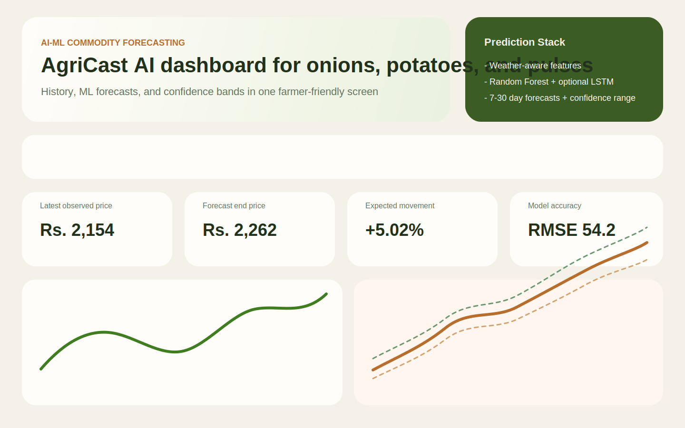
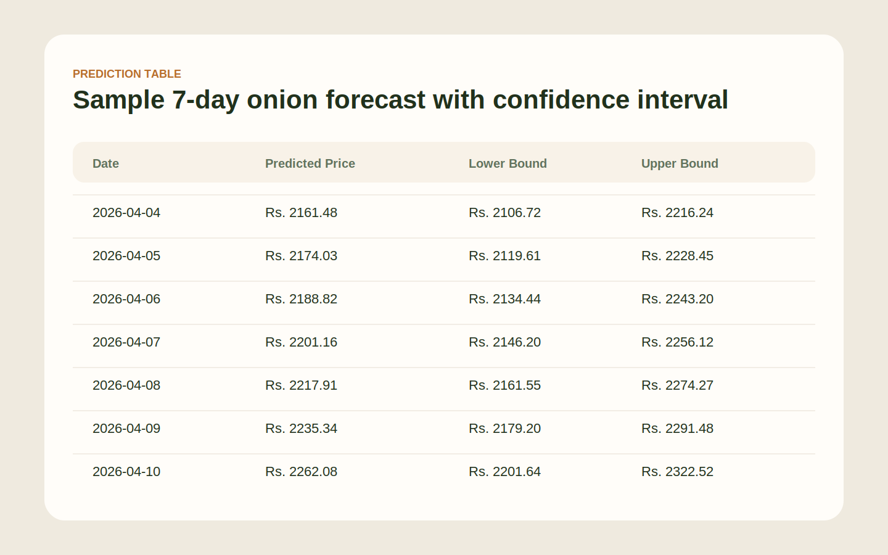

# AI-ML Based Price Prediction System for Agri-Horticultural Commodities

A full-stack web application that predicts future prices of onion, potato, and pulses using machine learning. The project combines a Flask REST API, feature-engineered forecasting models, and a React dashboard designed for farmer-friendly decision support.

## Project Structure

```text
.
|-- backend/
|   |-- api/
|   |-- data/
|   |-- services/
|   |-- utils/
|   |-- app.py
|   `-- requirements.txt
|-- frontend/
|   |-- public/
|   |-- src/
|   |-- package.json
|   `-- vercel.json
|-- models/
|-- screenshots/
|-- render.yaml
`-- README.md
```

## Features

- Predicts 7, 14, 21, or 30 days ahead for onion, potato, and pulses
- Random Forest Regression as the default production model
- Optional LSTM training when TensorFlow is available
- Historical trends, future forecasts, and confidence intervals
- REST API endpoints for model training, prediction, and price history
- Demo-ready synthetic dataset shaped like mandi/Agmarknet-style commodity data
- Clean dashboard built with React and Recharts

## Tech Stack

- Frontend: React, Vite, Axios, Recharts, Lucide React
- Backend: Flask, Flask-CORS, pandas, numpy, scikit-learn, joblib
- Deployment:
  - Full stack: Vercel

## API Endpoints

- `GET /health`
- `GET /get-history?commodity=onion&lookback_days=60`
- `POST /train-model`
- `POST /predict`

### Example `/predict` request

```json
{
  "commodity": "onion",
  "model_type": "random_forest",
  "horizon_days": 7
}
```

### Sample prediction output

```json
{
  "commodity": "onion",
  "modelType": "random_forest",
  "horizonDays": 7,
  "latestObservedPrice": 2154.0,
  "predictions": [
    {
      "date": "2026-04-04",
      "predicted_price": 2161.48,
      "lower_bound": 2106.72,
      "upper_bound": 2216.24
    },
    {
      "date": "2026-04-05",
      "predicted_price": 2174.03,
      "lower_bound": 2119.61,
      "upper_bound": 2228.45
    }
  ],
  "metrics": {
    "mae": 38.42,
    "rmse": 54.2,
    "r2": 0.9214
  }
}
```

## Machine Learning Design

### Random Forest

- Uses lag features, rolling averages, rolling standard deviation, arrivals, rainfall, and temperature
- Commodity-specific model files are saved to the `models/` directory
- Confidence intervals are estimated from the variance across decision trees

### LSTM

- Supported in the standalone Flask backend codebase
- Omitted from the Vercel serverless deployment to keep production hosting reliable
- The deployed app uses Random Forest as the production prediction engine

## Screenshots

Dashboard overview:



Prediction table:



## Local Setup

### 1. Backend

```bash
cd backend
python -m venv .venv
.venv\\Scripts\\activate
pip install -r requirements.txt
python app.py
```

Backend runs at `http://localhost:5000`.

### 2. Frontend

```bash
cd frontend
copy .env.example .env
npm install
npm run dev
```

Frontend runs at `http://localhost:5173`.

Set `VITE_API_BASE_URL=http://localhost:5000` in `frontend/.env` for local development, or leave it empty in Vercel to use same-origin `/api` routes.

## Deployment

### Full Stack on Vercel

- Import the repository into Vercel
- Set the project root to `frontend`
- The React dashboard is built by Vite
- The API is served from `frontend/api/[...route].py` as Vercel Python serverless functions
- `VITE_API_BASE_URL` is optional for production on Vercel, because the frontend can call same-origin `/api/*`

### Frontend on Netlify

- Set base directory to `frontend`
- Build command: `npm run build`
- Publish directory: `dist`
- `frontend/netlify.toml` is already included

## Notes

- If the CSV dataset is missing or too small, the API auto-generates a larger synthetic demo dataset in memory.
- For a real deployment, replace `backend/data/commodity_prices.csv` with Agmarknet or mandi historical data.
- Weather features are currently demo/synthetic-friendly and can be swapped for a real weather API later.
- The Vercel deployment is optimized around Random Forest for stability and faster cold starts.

## Deliverables Status

- GitHub repository link: to be created after publishing this workspace to GitHub
- Live deployment link: to be created after Vercel redeploy
- Screenshots: included in `screenshots/`
- Sample prediction output: included above
- Local run instructions: included above
